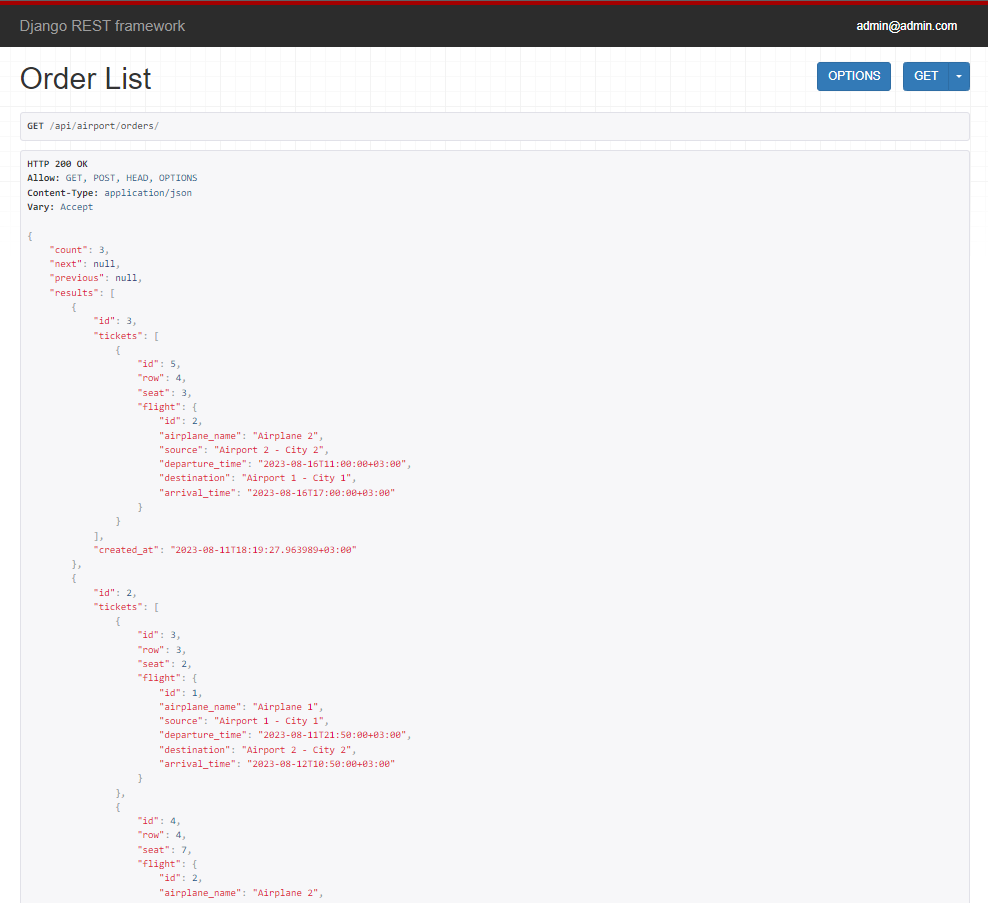
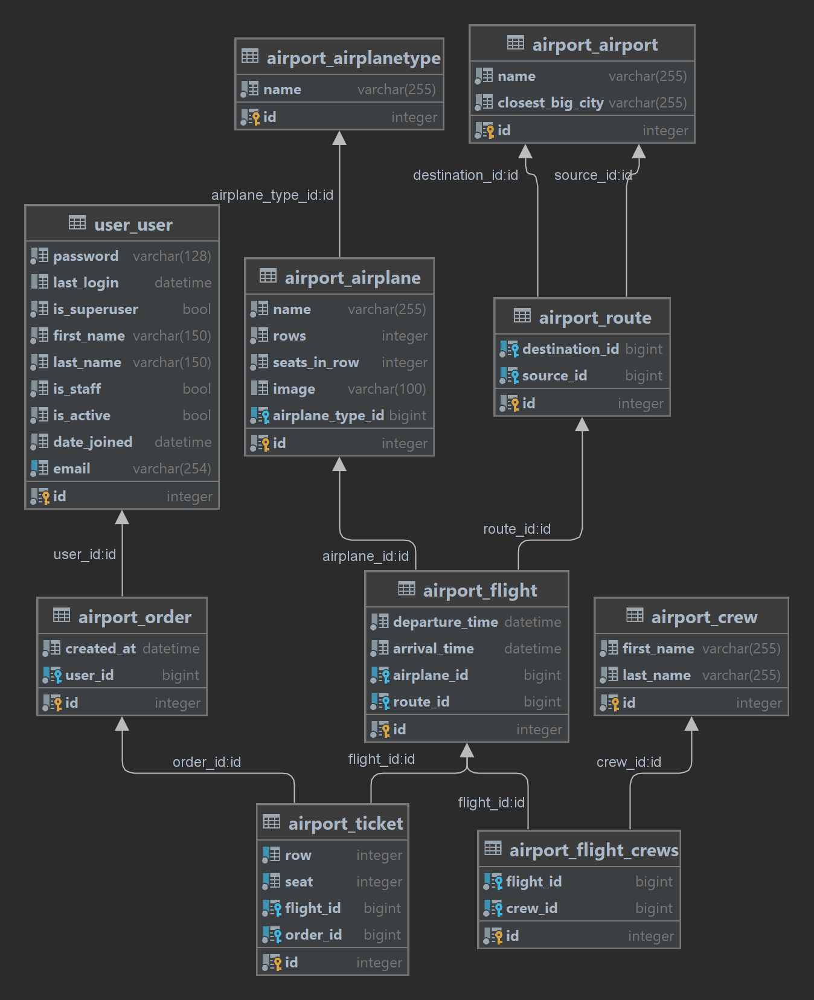

# SkyPort API: Elevating Airport Services

### Airport_api_service

You can register on this api_service. 
You can get api for Airplane, AirplaneType, Crew, Airport, Route, Flight, Order.
You can also check out the Swagger documentation. 
This service is needed to manage the airport, add new data, view flights,
filter by necessary parameter, you can place an order and buy necessary tickets for traveling.
You can also see the history of your orders.

### Documentation on Swagger
.../api/doc/swagger/

### Installation

Python3 must be already installed

```shell
git clone https://github.com/YehorKorn/pet_project_airport_api_service.git
cd pet_project_airport_api_service.git
python3 -m venv venv
source venv/bin/activate
pip install -r requirements.txt
python manage.py migrate
python manage.py runserver
```

- Next activate your venv 
  - `venv\Scripts\activate` (on Windows)
  - `source venv/bin/activate` (on macOS)

For initial db use this command `python manage.py migrate`

For will download fixture (fill databases information) run this `python manage.py loaddata airport_api_fixture.json`

## Features

* Authentication JWT functional for User/Admin
* Api Airport-------------create/list
* Api Route--------------create/list
* Api AirplaneType-----create/list
* Api Airplane-----------create/list/upload_image
* Api Crew---------------create/list
* Api Flight---------------create/list/retrieve/update
     * Filter by date/source/destination
* Api Order---------------create/list

### Authentication data to log in to the api_service
1. For Sign-in by admin use:
    - email: `admin@admin.com`
    - password: `1qazcde3`

## Demo




## Data base structure



